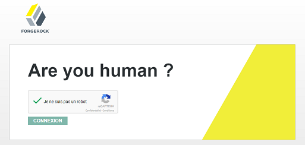
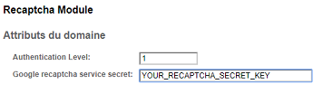
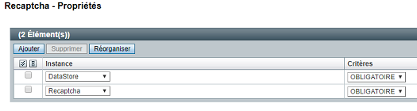

# openam-recaptcha-module



This is an authentication module that prompts the user a reCAPTCHA challenge. This module is intended to be used after
another module (ie. LDAP).

This module has been tested on OpenAM 11.0.3 community edition but can easiy be adapted for more recent version.

## Installation

```bash
git clone
cd openam-recaptcha-module
mvn clean package
```

Copy the *target/openam-recaptcha-module-1.0.0.jar* into the OpenAM *WEB-INF/lib/* folder.

Inside *recaptcha.jsp* file, replace the *data-sitekey* tag value with your own reCAPTCHA secret key.

```
data-sitekey="RECAPTCHA_SECRET"
```

Copy the file *recaptcha.jsp* into the OpenAM *config/auth/default/* folder.

Register the module using the following *ssoadm* commands:

```bash
ssoadm create-svc -u amadmin -f pwdfile -X src/main/resources/amAuthRecaptchaModule.xml
ssoadm register-auth-module -u amadmin -f pwdfile -a com.mirzlab.openam.RecaptchaModule
```

Restart your container.

## Configuration

Configure the Recaptcha module instance with your reCAPTCHA secret key.



Configure an authentication chain with the module LDAP (or DataStore) followed by the Recaptcha module (both as required).



## Let's test

Test that the module is working by using the created authentication chain:

```
https://openam.example.com:8443/openam/UI/Login?service=Recaptcha
```

After entering the username and password, the user will be prompted a reCAPTCHA challenge.
